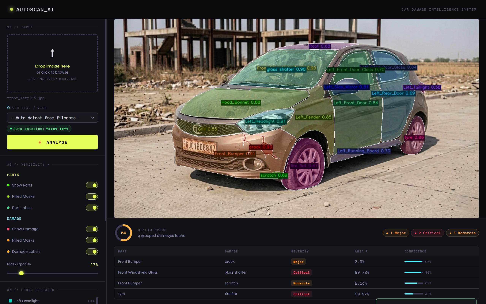

# AutoScan AI — Car Damage Analysis System

> An end-to-end AI pipeline that detects, segments, validates, and scores car damage from a single photograph — running locally on GPU via a Flask web interface. 

---

## Table of Contents

1. [Overview](#overview)
2. [Tech Stack](#tech-stack)
3. [System Requirements](#system-requirements)
4. [Quick Start](#quick-start)
5. [Project Structure](#project-structure)
6. [Detailed Pipeline Flow](#detailed-pipeline-flow)
7. [Configuration Reference](#configuration-reference)
8. [Models](#models)
9. [Car Part Classes](#car-part-classes)
10. [Damage Classes & Severity Rules](#damage-classes--severity-rules)
11. [API Endpoints](#api-endpoints)
12. [Validation Logic](#validation-logic)
13. [Health Score Formula](#health-score-formula)
14. [Evaluation](#evaluation)
15. [User Interface](#user-interface)
16. [Acknowledgements](#acknowledgements)

---

## Overview

AutoScan AI is a Project which takes a photograph of a car and performs:

- **Car detection** — locates the vehicle using YOLOv8
- **Parts segmentation** — identifies up to 29 named car parts using RF-DETR
- **Damage segmentation** — detects 6 types of damage using RF-DETR with tile inference
- **Validation** — filters spatially impossible damage-part combinations
- **Analytics** — generates a 0–100 health score with per-part severity breakdown
- **Visualization** — overlays color-coded masks and labels on the original image

The entire inference pipeline runs on a local GPU (tested on RTX 5070 8 GB).  
The frontend is a single-page dark-themed web app served by Flask.

---

## Tech Stack

| Layer | Technology |
|---|---|
| Web Framework | Flask |
| Car Detection | YOLOv8 (Ultralytics) |
| Parts & Damage Segmentation | RF-DETR (Roboflow) |
| Image Processing | OpenCV, Pillow, NumPy |
| GPU Inference | CUDA via PyTorch |
| Frontend | Vanilla HTML / CSS / JavaScript |
| Model Optimization | `torch.jit.trace` via `optimize_for_inference()` |

---

## System Requirements

| Component | Minimum | Recommended |
|---|---|---|
| GPU VRAM | 6 GB | 8 GB |
| RAM | 8 GB | 16 GB |
| Python | 3.10+ | 3.13 |
| CUDA | 12.7+ | 12.9 |
| OS | Windows / Linux | Windows 11 |

> **Note:** Input images are automatically resized to a max of **1920 px** on the longest side before inference to prevent CUDA out-of-memory errors on high-resolution camera photos (e.g. 4608×3072). Configurable via `MAX_INPUT_RESOLUTION` in `config.py`.

---

## Quick Start

```bash
# 1. Install dependencies
pip install -r requirements.txt

# 2. Edit config/config.py — set your model checkpoint paths
#    YOLO_CHECKPOINT   = r"path\to\yolov8m.pt"
#    PARTS_CHECKPOINT  = r"path\to\checkpoint_parts.pth"
#    DAMAGE_CHECKPOINT = r"path\to\checkpoint_damage.pth"

# 3. Run
python app.py
# → Open http://localhost:5000
```

---

## Project Structure

```
car-damage-and-parts-segmentation/
├── app.py                              ← Flask entry point; registers blueprint, cleans uploads on start
├── requirements.txt
├── README.md                           ← Main README File
├── config/
│   └── config.py                       ← ALL tunable settings (paths, thresholds, resolutions, etc.)
├── uploads/                            ← Uploaded images saved here; auto-cleaned on startup
│   └── processed/
├── base/
│   ├── templates/
│   │   └── car_analysis/
│   │       └── index.html              ← Single-page frontend (dark industrial UI)
│   ├── static/
│   │   └── UI_Image/
│   │       └── UI_Screenshot.png       ← App UI screenshot (used in README)
│   └── com/
│       ├── controller/
│       │   └── car_analysis_controller.py   ← /analysis/upload and /analysis/render endpoints
│       └── service/
│           ├── image_analysis.py           ← Stage 1: YOLO car bounding-box detection
│           ├── car_parts_segmentation.py   ← Stage 2: RF-DETR 29-class parts segmentation
│           ├── car_damage_segmentation.py  ← Stage 3: RF-DETR 6-class damage + tile inference
│           ├── damage_validation.py        ← Stage 4: Spatial false-positive filter
│           ├── damage_analytics.py         ← Stage 5: Health score + per-part severity report
│           ├── output_handler.py           ← Pipeline orchestrator (calls stages 1–5)
│           └── coco_annotations.py         ← Optional COCO JSON export
└── evaluation/
    ├── README.md                               ← Top-level evaluation overview
    ├── Car Damage/
    │   ├── README.md                           ← CarDD dataset & damage model evaluation
    │   ├── Testing/
    │   │   └── evaluate_rfdetr_cardd_full.py   ← Full test-set evaluation script
    │   └── Training and Validation/
    │       └── plot_training_metrics.py        ← Training chart generator
    └── Car Parts/
        ├── README.md                           ← Car parts dataset & model evaluation
        ├── Testing/
        │   └── evaluate_rfdetr_carparts.py     ← Full test-set evaluation script
        └── Training and Validation/
            └── plot_parts_metrics.py           ← Training chart generator
```

---

## Detailed Pipeline Flow

### High-Level Overview

```
User Uploads Image
        │
        ▼
[Auto-Resize] ──── if > 1920px longest side → downscale (LANCZOS4)
        │
        ▼
[Stage 1] YOLOv8 Car Detection
  → Finds the largest car bounding box
  → Adds 2% padding around it
  → Output: coords (x1, y1, x2, y2)
        │
        ▼
[Stage 2] RF-DETR Parts Segmentation (RFDETRSegNano, 960px)
  → Pre-NMS: collapse overlapping duplicate raw-class masks (IoU > 0.30)
  → Converts 19 raw classes → 29 Left/Right named classes using car side
  → Singleton enforcement: drop duplicate detections for classes
    that can only appear once (e.g. Left_Headlight)
  → Output: det_parts (masks + class IDs + labels)
        │
        ▼
[Stage 3] RF-DETR Damage Segmentation (RFDETRSegMedium, 960px)
  → Full-ROI pass: detects damage on the entire car crop
  → Tile pass: 2×2 grid with 35% overlap → finds small/fine damage
    (only crack, dent, scratch on tiles)
  → Smart merge NMS: merges overlapping/touching tile + full detections
  → Output: det_damage (masks + class IDs + confidence)
        │
        ▼
[Stage 4] Damage Validation (Spatial Filter)
  → Cross-references damage masks against part masks
  → First, a rule that applies to EVERY damage type:
      • if more than 60% of the damage mask lies off every named part
        → dropped as "mostly unknown region" (crack included)
  → Then type-specific rules, over the parts covering >= 20% of the mask:
      • dent          → must touch a part that is not glass / tyre / lamp
      • glass shatter → must touch a glass part
      • lamp broken   → must touch a lamp AND nothing else
      • tire flat     → must touch the tyre
      • scratch       → must touch a part, and must touch NO glass
      • crack         → no part rule beyond the unknown-region check
  → Removes spatially impossible detections
  → Output: filtered det_damage
        │
        ▼
[Stage 5] Analytics Engine
  → For each damage, finds which part(s) it overlaps by ≥15% AND
    are permitted for that damage type
  → Computes damage_percent = overlap_pixels / part_pixels × 100
  → Applies severity rules per damage type and percentage
  → Sums severity penalties → Health Score = max(0, 100 − Σ penalties)
  → Output: JSON report (health score, per-part severity rows)
        │
        ▼
[Drawing Pass]
  → Draws part masks on canvas (color-coded, with smooth contours)
  → Draws damage masks on canvas (semi-transparent overlay)
  → Adds labels at mask centroids
        │
        ▼
[Response]
  → original_image (base64 JPEG)
  → annotated_image (base64 JPEG)
  → parts_detections + damage_detections (metadata for legend)
  → analytics (health score + damage table)
  → Detections stored in server session for re-render
        │
        ▼
[Re-Render (no re-inference)]
  User toggles visibility / opacity →
  Frontend calls /analysis/render →
  Server re-draws from stored session detections (no model called again)
```

---

### Car Side Detection Sub-Flow

```
Image filename checked for prefix
        │
  Has prefix?  ──── YES ──→ Use prefix (e.g. "front_left_car.jpg" → "front_left")
        │
       NO
        │
  User selected from dropdown? ──── YES ──→ Use dropdown value as fallback
        │
       NO
        │
  Block analysis — return 422 error
  "Car side could not be determined"
```

Valid side prefixes: `front`, `rear`, `left`, `right`, `front_left`, `front_right`, `rear_left`, `rear_right`

---

### Parts Pre-Processing Sub-Flow (inside Stage 2)

```
Raw model output (19 classes)
        │
        ▼
Pre-NMS: For each raw class group
  → Sort detections by confidence (highest first)
  → Compute mask IoU between detections of same class
  → Suppress if IoU > 0.30 (keep highest confidence)
        │
        ▼
Side-aware class conversion (19 → 29 classes)
  → Fixed classes (Grill, Hood, Bumpers, etc.) pass through as-is
  → Side-dependent classes (Fender, Door, Headlight, etc.)
    get Left_ / Right_ prefix based on car side + box center X
  → Special: if rear view and 2 taillights detected →
    left-most = Left_Taillight, right-most = Right_Taillight
        │
        ▼
Singleton enforcement (post-conversion)
  → For each class that can appear once per image:
    if count > 1 → keep only highest-confidence detection
```

---

### Damage Tile Inference Sub-Flow (inside Stage 3)

```
Car ROI (cropped from original image)
        │
        ├──→ Full-ROI pass → detect all 6 damage types
        │
        └──→ Tile pass (2×2 grid, 35% overlap):
               For each tile:
                 → Crop tile from ROI
                 → Run RF-DETR (higher threshold = 0.55)
                 → Only keep: crack, dent, scratch
                 → Offset detections back to full image coords
        │
        ▼
Smart Merge NMS across all detections:
  → Sort by confidence descending
  → For each detection, merge with others of same class if:
      box IoU > 0.35  OR
      mask IoU > 0.25 OR
      mask coverage > 0.80 OR
      masks touch within 3 px gap
  → Merged box = union of boxes, merged mask = union of masks
```

---

## Configuration Reference

Most settings live in `config/config.py`. Three validation and attribution
thresholds are defined in the service files instead, because they are part of the
filtering logic rather than deployment configuration:

| Constant | Value | File |
|---|---|---|
| `OVERLAP_THRESHOLD` | 0.20 | `damage_validation.py` |
| `UNKNOWN_DOMINANCE_THRESHOLD` | 0.60 | `damage_validation.py` |
| `MIN_ATTRIBUTION_OVERLAP` | 0.15 | `damage_analytics.py` |

```python
# ── PATHS ─────────────────────────────────────────────────────────────
YOLO_CHECKPOINT   = r"path\to\yolov8m.pt"
PARTS_CHECKPOINT  = r"path\to\parts_model.pth"
DAMAGE_CHECKPOINT = r"path\to\damage_model.pth"

# ── INPUT LIMITS ──────────────────────────────────────────────────────
MAX_CONTENT_LENGTH   = 20 * 1024 * 1024   # 20 MB max upload
MAX_INPUT_RESOLUTION = 1920               # Longest side cap before inference
                                          # (set 0 to disable)

# ── MODEL RESOLUTIONS ─────────────────────────────────────────────────
PARTS_RESOLUTION  = 960    # RF-DETR internal resolution for parts model
DAMAGE_RESOLUTION = 960    # RF-DETR internal resolution for damage model

# ── DETECTION THRESHOLDS ──────────────────────────────────────────────
PARTS_THRESHOLD  = 0.45    # Minimum confidence to accept a parts detection
DAMAGE_THRESHOLD = 0.40    # Minimum confidence (full-ROI pass)
TILE_THRESHOLD   = 0.55    # Minimum confidence (tile pass, higher = stricter)

# ── TILE INFERENCE ────────────────────────────────────────────────────
USE_TILE_INFERENCE = True
GRID_ROWS   = 2
GRID_COLS   = 2
OVERLAP_RATIO   = 0.35     # 35% tile overlap to avoid missing edge damage
MIN_TILE_SIZE   = 300      # Minimum tile size in pixels

# ── MERGE NMS ─────────────────────────────────────────────────────────
BOX_IOU_THRESHOLD       = 0.35
MASK_IOU_THRESHOLD      = 0.25
MASK_COVERAGE_THRESHOLD = 0.80
TOUCH_GAP_PIXELS        = 3    # Masks within 3px are treated as touching

# ── ANALYTICS ─────────────────────────────────────────────────────────
MIN_EXTERNAL_PIXELS = 150  # Min damage pixels for "unknown" (unmatched) damage
PADDING_RATIO       = 0.02 # 2% padding added around YOLO car bounding box
SEVERITY_RULES      = {...}  # Per-damage-type percentage bands (table below)
SEVERITY_PENALTY    = {...}  # Points deducted per severity level

# ── FLASK ───────────────────────────────────────────────────────────────────
SECRET_KEY = "..."         # Session signing key - change before deploying
DEBUG      = True          # Development only; see the warning below
HOST       = "0.0.0.0"
PORT       = 5000

# ── MISC ────────────────────────────────────────────────────────────────────
ALLOWED_EXTENSIONS = {"png", "jpg", "jpeg", "webp"}
TILE_DAMAGE_NAMES  = {"dent", "scratch", "crack"}  # Kept from the tile pass
SAVE_COCO_DEFAULT  = False  # Write a COCO JSON alongside each analysis
```

> **Warning — development defaults.** The repository ships `DEBUG = True` with
> `HOST = "0.0.0.0"`. Flask's debugger allows arbitrary code execution through
> the browser, and `0.0.0.0` binds every network interface, so running as-is
> exposes a shell to anyone who can reach the port. Set `DEBUG = False` and
> replace the hard-coded `SECRET_KEY` before running this anywhere but your
> own machine.

---

## Models

| Model | Architecture | Task | Classes |
|---|---|---|---|
| YOLOv8m | YOLOv8 Medium | Car bounding box detection | COCO class 2 (car) |
| RFDETRSegNano | RF-DETR Nano + Segmentation | Car parts instance segmentation | 19 raw → 29 final |
| RFDETRSegMedium | RF-DETR Medium + Segmentation | Car damage instance segmentation | 6 damage types |

Both RF-DETR models are optimized at startup using `model.optimize_for_inference(compile=True, batch_size=1, dtype=torch.float32)` which applies `torch.jit.trace` for faster GPU kernel execution with zero quality loss.

---

## Car Part Classes

The parts model outputs **29 final classes** (19 raw model classes converted via side-aware logic):

```
Fixed (side-independent):
  Diggi_Back_Door, Diggi_Back_Door_Glass, Front_Bumper,
  Front_Windshield_Glass, Grill, Hood_Bonnet, Rear_Bumper, Roof, tyre

Left side:
  Left_Fender, Left_Front_Door, Left_Front_Door_Glass,
  Left_Headlight, Left_Quarter_Panel, Left_Rear_Door,
  Left_Rear_Door_Glass, Left_Running_Board, Left_Side_Mirror, Left_Taillight

Right side:
  Right_Fender, Right_Front_Door, Right_Front_Door_Glass,
  Right_Headlight, Right_Quarter_Panel, Right_Rear_Door,
  Right_Rear_Door_Glass, Right_Running_Board, Right_Side_Mirror, Right_Taillight
```

**Singleton enforcement** ensures the following 22 classes appear at most once per image:
all Left_* and Right_* classes + `Diggi_Back_Door_Glass` + `Front_Windshield_Glass`

---

## Damage Classes & Severity Rules

### 6 Damage Types

| Class | Color |
|---|---|
| crack | Red `#FF0000` |
| dent | Blue `#0000FF` |
| glass shatter | Cyan `#00FFFF` |
| lamp broken | Orange `#FFA500` |
| scratch | Green `#00FF00` |
| tire flat | Purple `#800080` |

### Severity Thresholds (% of affected part area)

| Damage Type | Minor | Moderate | Major | Critical |
|---|---|---|---|---|
| scratch | ≤ 1.5% | ≤ 4% | ≤ 8% | > 8% |
| dent | ≤ 2% | ≤ 5% | ≤ 10% | > 10% |
| crack | ≤ 1% | ≤ 3% | ≤ 6% | > 6% |
| glass shatter | — | — | ≤ 5% | > 5% |
| lamp broken | — | — | ≤ 5% | > 5% |
| tire flat | — | — | — | Always |

### Severity Penalty Points

| Severity | Penalty |
|---|---|
| Minor | −3 |
| Moderate | −6 |
| Major | −10 |
| Critical | −15 |

---

## API Endpoints

| Method | URL | Description |
|---|---|---|
| GET | `/` | Main frontend page |
| POST | `/analysis/upload` | Upload image → full inference pipeline |
| POST | `/analysis/render` | Re-render stored detections (no inference) |

---

### POST `/analysis/upload`

**Form fields:**

| Field | Type | Description |
|---|---|---|
| `image` | File | Car photograph (JPG/PNG/WEBP, max 20 MB) |
| `car_side` | String | Optional: `front`, `rear`, `left`, `right`, `front_left`, `front_right`, `rear_left`, `rear_right` |
| `show_parts` | `1`/`0` | Draw parts masks on annotated image |
| `show_damage` | `1`/`0` | Draw damage masks on annotated image |
| `parts_filled` | `1`/`0` | Filled vs. outline-only parts masks |
| `damage_filled` | `1`/`0` | Filled vs. outline-only damage masks |
| `parts_labels` | `1`/`0` | Show part name labels |
| `damage_labels` | `1`/`0` | Show damage type + confidence labels |
| `mask_alpha` | Float | Mask transparency 0.05–0.90 |

> **Important:** Damage inference **always runs** regardless of `show_damage`. The toggle only controls drawing. This ensures the health score and legend are always accurate even if you upload with damage overlay hidden.

**Response:**
```json
{
  "success": true,
  "original_image": "<base64 JPEG>",
  "annotated_image": "<base64 JPEG>",
  "coords": [x1, y1, x2, y2],
  "parts_warning": "",
  "parts_detections": [
    { "class_name": "Hood_Bonnet", "confidence": 0.91, "color": "#FF3838" }
  ],
  "damage_detections": [
    { "class_name": "dent", "confidence": 0.78, "color": "#0000FF" }
  ],
  "analytics": {
    "overall_health_score": 75,
    "total_damages": 3,
    "summary": "3 grouped damages found",
    "parts": [
      {
        "part_name": "Hood_Bonnet",
        "damage_type": "dent",
        "severity": "Moderate",
        "damage_percent": 4.2,
        "confidence": 0.78,
        "affected_pixels": 18340
      }
    ]
  }
}
```

---

### POST `/analysis/render`

Re-renders the canvas with new toggle/opacity settings **without re-running any model inference**. Requires a previous `/upload` call in the same session.

**JSON body:**
```json
{
  "show_parts":    true,
  "parts_filled":  true,
  "parts_labels":  true,
  "show_damage":   true,
  "damage_filled": false,
  "damage_labels": true,
  "mask_alpha":    0.40
}
```

**Response:**
```json
{
  "success": true,
  "annotated_image": "<base64 JPEG>"
}
```

---

## Validation Logic

The `damage_validation.py` service removes damage detections that cannot
physically sit where the parts model says they are.

**Step 1 — the unknown-region check, applied to every damage type including
crack.** A part counts as "overlapping" only if it covers at least
`OVERLAP_THRESHOLD` (20%) of the damage mask. If less than 40% of the mask lies
on *any* named part — i.e. more than `UNKNOWN_DOMINANCE_THRESHOLD` (60%) of it is
on unsegmented background — the detection is dropped outright. This check runs
before any type-specific rule, so it can discard a damage of any class.

**Step 2 — the type-specific rule.** Note that these are *not* symmetric: only
`lamp broken` is exclusive, meaning it is the only rule that rejects a detection
for *also* touching something else.

| Damage Type | Rule as implemented | Exclusive? |
|---|---|---|
| dent | must touch at least one part that is not glass, tyre, headlight or taillight | no |
| glass shatter | must touch at least one glass part | no — may also overlap other parts |
| lamp broken | must touch a lamp part **and nothing else** | **yes** |
| tire flat | must touch the tyre | no — may also overlap other parts |
| scratch | must touch a named part, and must touch **no** glass part | no |
| crack | no type rule; only the Step 1 check applies | — |

Glass parts are the six `*_Glass` classes; lamp parts are the four
`Left_/Right_Headlight` and `Left_/Right_Taillight` classes.

---

## Health Score Formula

```
Health Score = max(0,  100  −  Σ(penalty per damage row))

Where each damage row's penalty depends on its severity:
  Minor    → −3 points
  Moderate → −6 points
  Major    → −10 points
  Critical → −15 points

Severity is determined by:
  damage_percent = (overlap_pixels / part_mask_pixels) × 100
  → looked up in per-damage-type severity threshold table

Unmatched external damage — damage for which no part was credited, meaning no
part both covered at least MIN_ATTRIBUTION_OVERLAP (15%) of the damage mask *and*
was permitted for that damage type — is handled as follows:

  below MIN_EXTERNAL_PIXELS (150 px)  → discarded; it does not appear at all
  at or above 150 px                  → listed as an "Unknown_External" row
                                        with severity "—" and penalty 0

Either way it never affects the health score: with no reference part area there
is no meaningful percentage, so no severity is assigned and no penalty applies.
```

**Example:**
- Left_Fender → scratch → 3.2% → Moderate → −6
- Hood_Bonnet → dent → 6.1% → Major → −10
- Left_Headlight → lamp broken → 7.3% → Critical → −15

Health Score = 100 − 6 − 10 − 15 = **69**

---

## Evaluation

The `evaluation/` directory contains all scripts, charts, and results used to benchmark both RF-DETR models on their respective test sets. Full metric tables are kept inside the evaluation READMEs.

### 📥 Model & Dataset Download

> **🔗 [Google Drive — Models & Datasets](https://drive.google.com/drive/folders/1KxSQLXaXxa2vOlMYNeq6UL5Ua1hEDirn?usp=drive_link)**

Download pre-trained model checkpoints (`checkpoint_best_total.pth`) and the corresponding test-set images + COCO annotations for both tasks from the link above.

### Sub-directories

| Folder | Dataset | Description |
|--------|---------|-------------|
| `evaluation/Car Damage/` | [CarDD](https://cardd-ustc.github.io/) | 374 test images · 785 annotations · 6 damage classes |
| `evaluation/Car Parts/` | [Eight public datasets, combined](#acknowledgements) | 540 test images · 4,591 annotations · 19 part classes |

Both models were **trained** on images resized to 1152 × 1152, but **evaluation does not repeat that resize**. RF-DETR interpolates its mask logits to the size of the image it is handed and thresholds them there, so feeding the original image returns masks already in original coordinates — no re-projection, and nothing lost at the mask boundary.

Each sub-directory has its own `README.md` with full metric tables, per-category AP breakdowns, usage instructions for the evaluation scripts, and training/validation charts.

---

## User Interface




## Acknowledgements

### Damage dataset — CarDD

> X. Wang, W. Li and Z. Wu, "CarDD: A New Dataset for Vision-Based Car Damage
> Detection," *IEEE Transactions on Intelligent Transportation Systems*,
> vol. 24, no. 7, pp. 7202-7214, July 2023, doi: 10.1109/TITS.2023.3258480.
> Project page: <https://cardd-ustc.github.io/>

### Parts dataset — eight public sources, combined

No single public dataset covers every part class this pipeline needs, so the
parts model was trained on a composite of **eight** public car-part segmentation
datasets — 11,547 images pooled, 7,708 retained after de-duplication and
remapping onto a unified 19-class taxonomy.

| # | dataset | platform | images | classes | licence |
|---|---|---|---:|---:|---|
| 1 | Car Parts Dataset (DSMLR, IT-KMITL) | GitHub | 500 | 18 | citation requested |
| 2 | Car parts - *Segmentation* | Roboflow Universe | 1,755 | 9 | CC BY 4.0 |
| 3 | Car Parts Segmentation - *Person Detector* | Roboflow Universe | 603 | 19 | CC BY 4.0 |
| 4 | Car parts - *FleetBlox* | Roboflow Universe | 1,862 | 33 | CC BY 4.0 |
| 5 | car-parts - *Axion Technical Service* | Roboflow Universe | 819 | 30 | CC BY 4.0 |
| 6 | car parts - *Habibullah* | Roboflow Universe | 2,866 | 16 | CC BY 4.0 |
| 7 | car-seg - *Gianmarco Russo* | Roboflow Universe | 2,255 | 21 | CC BY 4.0 |
| 8 | car-parts - *Atheer Algarni* | Roboflow Universe | 887 | 20 | CC BY 4.0 |

The DSMLR dataset sets no formal licence but requests citation of its paper:

> K. Pasupa, P. Kittiworapanya, N. Hongngern and K. Woraratpanya, "Evaluation of
> deep learning algorithms for semantic segmentation of car parts," *Complex &
> Intelligent Systems*, 2021, pp. 1-13, doi: 10.1007/s40747-021-00397-8.
> Dataset: <https://github.com/dsmlr/Car-Parts-Segmentation>

The seven Roboflow Universe datasets, in table order:
[2](https://universe.roboflow.com/segmentation-9q8ob/car-parts-llqro) ·
[3](https://universe.roboflow.com/person-detector/car-parts-segmentation) ·
[4](https://universe.roboflow.com/fleetblox-car-damage/car-parts-bzaux) ·
[5](https://universe.roboflow.com/axion-technical-service-pvt-ltd/car-parts-xal6u) ·
[6](https://universe.roboflow.com/habibullah-hmpb8/car-parts-chf9t) ·
[7](https://universe.roboflow.com/gianmarco-russo-vt9xr/car-seg-un1pm) ·
[8](https://universe.roboflow.com/atheer-algarni-gvico/car-parts-ypa1r)

### Models and tools

- **RF-DETR** (Roboflow, Apache-2.0) — both segmentation models.
  > I. Robinson, P. Robicheaux, M. Popov, D. Ramanan and N. Peri, "RF-DETR:
  > Neural Architecture Search for Real-Time Detection Transformers,"
  > arXiv:2511.09554, 2025. <https://github.com/roboflow/rf-detr>
- **YOLOv8** (Ultralytics, AGPL-3.0) — vehicle localisation.
  > G. Jocher, A. Chaurasia and J. Qiu, "Ultralytics YOLOv8," 2023.
  > <https://github.com/ultralytics/ultralytics>
- [RF-DETR segmentation guide](https://blog.roboflow.com/train-rf-detr-segmentation)
  and [fine-tuning notebook](https://github.com/roboflow/notebooks/blob/main/notebooks/how-to-finetune-rf-detr-on-segmentation-dataset.ipynb)
